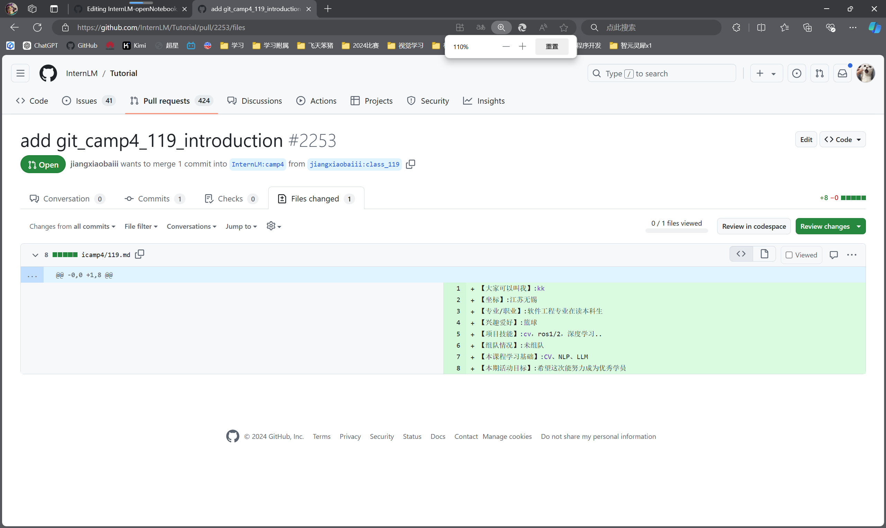
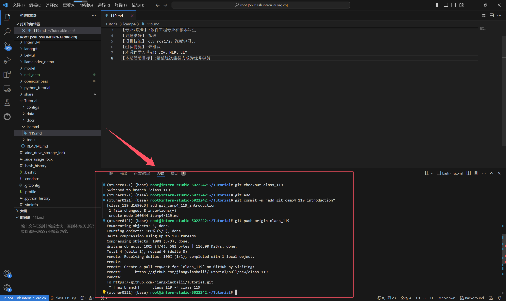
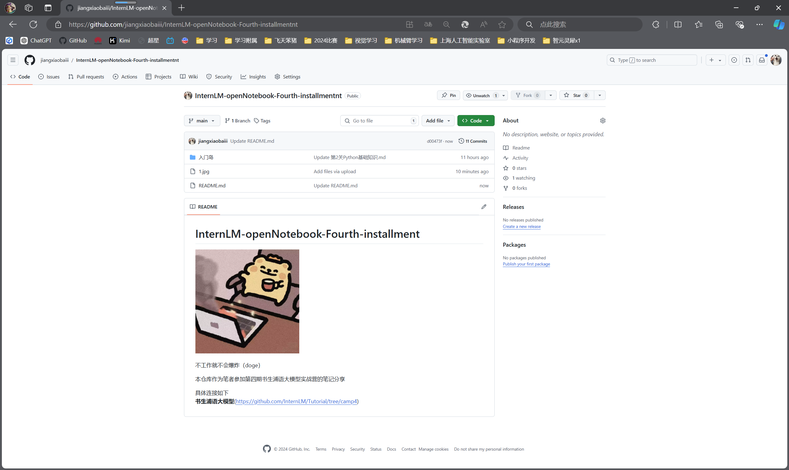

# Git 课程任务

## 任务概览

- **任务1**: 破冰活动：自我介绍
- **任务2**: 实践项目：构建个人项目

# 1 破冰活动
提交一份自我介绍。
- 1 将该项目复制到你自己的GitHub账户下，fork 项目https://github.com/InternLM/Tutorial
- 2 克隆Fork的项目到本地
bash
git clone https://github.com/your_username/project_name.git

- 3 添加上游仓库
- 4 拉取最新更改
- 5 创建新分支
- 6 进行修改
- 7 提交更改
- 8 推送至远程仓库
- 9 创建Pull Request:
  - 回到你的GitHub仓库页面，你会看到一个提示说可以从你的分支向原项目发送一个Pull Request。
  - 点击“Compare & pull request”按钮，填写PR描述，然后提交。

上传成功

终端上传

# 2 实践项目：构建个人项目
如下图所示为笔者所创建成功的笔记仓库
链接为https://github.com/jiangxiaobaiii/InternLM-openNotebook-Fourth-installmentnt

